# Design Document — BRO Resolve SaaS Platform

## Overview

Este documento descreve o design completo para evoluir o BRO Resolve de um sistema single-tenant com state machine hardcoded para uma plataforma SaaS multi-tenant com Flow Engine dinâmico, três níveis de acesso (MASTER, OWNER, OPERATOR), gestão financeira real (Caso), e um Attention Loop event-driven.

### Estado Atual vs. Estado Futuro

| Aspecto | Atual | Futuro |
|---------|-------|--------|
| Tenant isolation | `global._currentTenantId` | JWT com tenantId no req, middleware enforced |
| Auth | Admin token único (header) | JWT (Owner/Operator) + AdminUser token (Master) |
| State Machine | Hardcoded em `stateMachine.js` (~300 linhas de switch/case) | Flow Engine dinâmico: Flow → Node no banco |
| Financeiro | `valorEntrada` + `valorExito` no Lead | Modelo Caso separado com Real_Revenue vs Open_Revenue |
| Dashboard | Single-role (admin vê tudo) | 3 interfaces: Master Panel, Owner Dashboard, Operator Interface |
| SLA | Simples (minutos desde criação) | Dual SLA: slaLeadMinutes + slaContratoHoras com filas dinâmicas |
| Reativação | Job cron básico | Sistema completo com métricas de conversão por reativação |
| Events | `safeRecordEvent` (falha silenciosa) | Event bus com garantia de entrega + Attention Loop |
| WebSocket | Básico (lead:new, lead:updated) | Completo com rooms por tenant + operator, SLA alerts |

### Decisões de Design Chave

1. **Migração incremental**: O Flow Engine coexiste com a state machine hardcoded durante a transição. Cada tenant pode usar `flowSource: 'legacy' | 'dynamic'`.
2. **Caso como entidade separada**: Lead e Caso são 1:1 mas com lifecycle independente. Lead termina em "virou_cliente", Caso continua até "finalizado".
3. **Event-first architecture**: Toda ação gera evento. O Attention Loop consome eventos para gerar alertas e atualizar filas.
4. **Cache com invalidação explícita**: Flow definitions cached em memória com TTL de 60s + invalidação por webhook de update.

---

## Architecture

### Diagrama de Arquitetura Geral

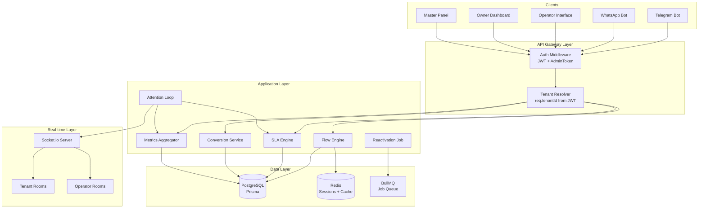

### Diagrama de Fluxo de Dados

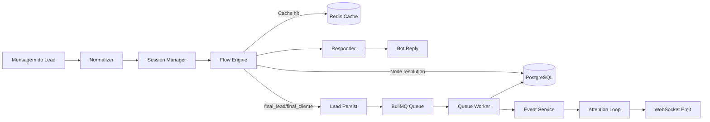


---

## Jornadas de Usuário (User Journeys) e Pontos de Falha Silenciosa

### Jornada 1: Lead — Qualificação via Bot

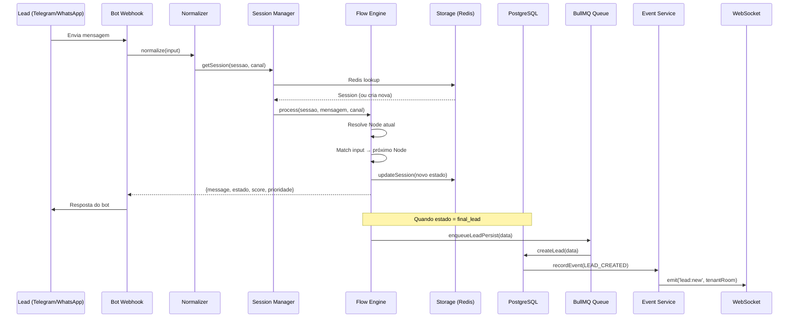

#### 🔴 Falhas Silenciosas — Jornada Lead

| # | Ponto de Falha | Código Atual | Impacto | Mitigação |
|---|---------------|-------------|---------|-----------|
| F1.1 | **Redis session lookup falha** | `safeRedisGet` faz fallback para memória sem log de alerta | Lead perde contexto da conversa se servidor reiniciar | Adicionar métrica de fallback + alerta quando Redis está down |
| F1.2 | **Flow Engine cache stale** | Cache sem invalidação explícita (Req 7.8) | Tenant atualiza fluxo mas leads continuam no fluxo antigo por tempo indeterminado | TTL 60s + invalidação por evento de update |
| F1.3 | **BullMQ job falha após 3 retries** | `worker.on('failed')` só loga no console | Lead completou fluxo mas nunca foi persistido no banco — **lead perdido** | Dead letter queue + alerta + retry manual endpoint |
| F1.4 | **`safeRecordEvent` engole erro** | `catch(err) { console.error(...); return null; }` | Evento LEAD_CREATED não registrado — funil de abandono fica incorreto | Event bus com garantia: retry + fallback para fila |
| F1.5 | **WebSocket emit sem listeners** | `emitToTenant` não verifica se há clients conectados | Operador não recebe notificação de novo lead | Adicionar fallback: push notification ou polling |
| F1.6 | **Normalizer descarta campos** | `normalize()` só extrai sessao/mensagem/canal | Dados de tracking (origem, campanha) podem ser perdidos se formato mudar | Validação de schema na entrada |
| F1.7 | **`global._currentTenantId` race condition** | Variável global compartilhada entre requests | Request A seta tenantId, Request B lê antes de setar o seu — **tenant isolation leak** | Eliminar global, usar req.tenantId do JWT |
| F1.8 | **Telegram timeout (5s)** | `res.sendStatus(200)` antes de processar | Se processamento falha, Telegram já recebeu 200 — sem retry | Background job com confirmação de sucesso |

---

### Jornada 2: Operator — Atendimento de Lead

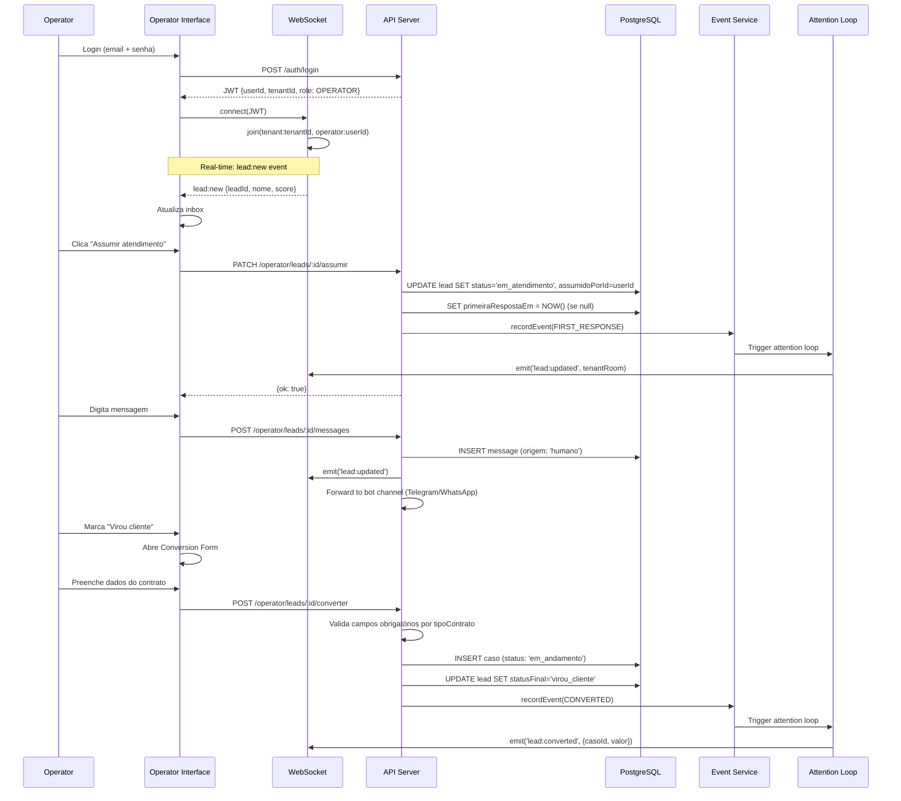

#### 🔴 Falhas Silenciosas — Jornada Operator

| # | Ponto de Falha | Código Atual | Impacto | Mitigação |
|---|---------------|-------------|---------|-----------|
| F2.1 | **WebSocket desconecta sem detecção** | `reconnectionAttempts: 5` no client, sem heartbeat check | Operador acha que está online mas não recebe updates — leads ficam sem atendimento | Heartbeat ping/pong + indicador visual de conexão |
| F2.2 | **Conversion Form bypassed** | Não existe no código atual — `markLeadOutcome` aceita qualquer statusFinal | Lead marcado como CONVERTIDO sem dados financeiros — receita fica zerada | Middleware de validação obrigatória antes de aceitar conversão |
| F2.3 | **`primeiraRespostaEm` não setado** | `updateLeadStatus` não verifica se é a primeira resposta | SLA mostra lead como "atrasado" mesmo após atendimento | Check explícito: `IF primeiraRespostaEm IS NULL THEN SET` |
| F2.4 | **Mensagem humana não chega ao lead** | Não há integração de envio para Telegram/WhatsApp no código atual | Operador envia mensagem no dashboard mas lead nunca recebe | Implementar bridge: message → bot channel forward |
| F2.5 | **Race condition: dois operadores assumem mesmo lead** | `updateMany` sem lock otimista | Dois operadores trabalham o mesmo lead — duplicação de esforço | `UPDATE ... WHERE assumidoPorId IS NULL` com check de affected rows |
| F2.6 | **Motivo de desistência não obrigatório** | `markLeadOutcome` aceita PERDIDO sem motivo | Análise de perda fica incompleta — Owner não sabe por que perde leads | Validação: `IF statusFinal === 'PERDIDO' AND !motivoDesistencia THEN reject` |

---

### Jornada 3: Owner — Dashboard Financeiro

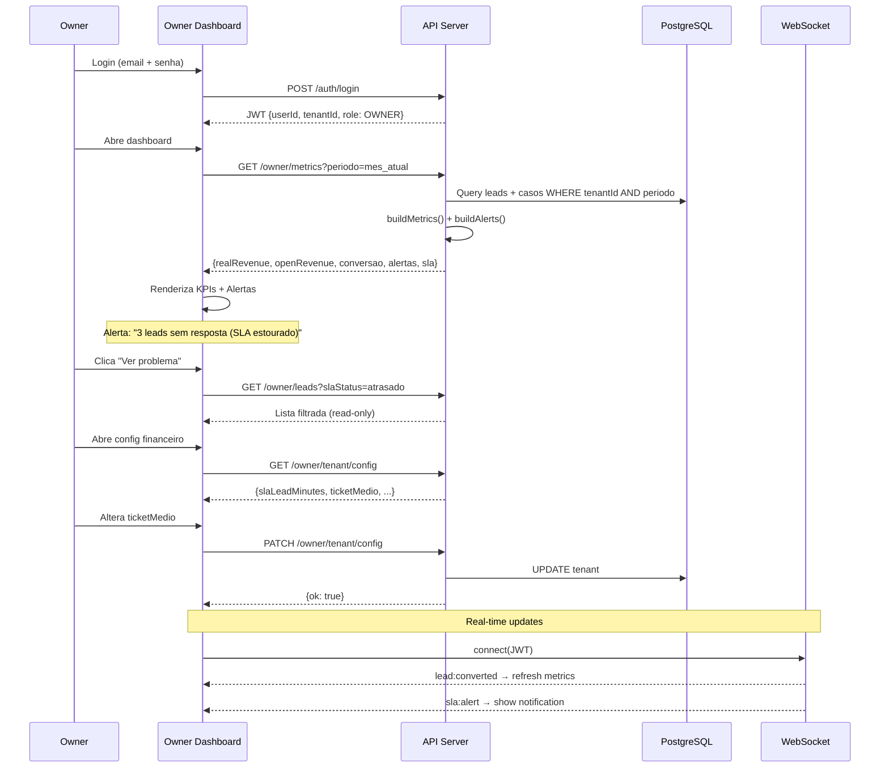

#### 🔴 Falhas Silenciosas — Jornada Owner

| # | Ponto de Falha | Código Atual | Impacto | Mitigação |
|---|---------------|-------------|---------|-----------|
| F3.1 | **Receita calculada com `toNumber` de Decimal** | `toNumber()` pode perder precisão em valores grandes | Receita exibida difere do valor real — Owner toma decisões erradas | Usar `Decimal.js` ou `BigInt` para cálculos financeiros |
| F3.2 | **`ensureTenant` auto-cria tenant** | Se tenantId inválido, cria tenant fantasma | Owner com JWT corrompido cria tenant lixo no banco | Remover auto-create, retornar 404 se tenant não existe |
| F3.3 | **Alertas não persistidos** | Alertas são calculados on-the-fly a cada request | Se Owner não abre dashboard, alertas nunca são vistos — leads apodrecem | Persistir alertas + enviar push/email para alertas críticos |
| F3.4 | **Open_Revenue sem Caso** | Código atual calcula receita futura do Lead, não do Caso | Valor estimado é impreciso (usa ticketMedio genérico) | Migrar para cálculo baseado em Caso: `valorEntrada + (percentualExito/100 × valorCausa)` |
| F3.5 | **Config update sem propagação** | `updateTenantConfig` atualiza DB mas não invalida caches | SLA Engine continua usando valores antigos até próximo restart | Emit evento `tenant:config_updated` → invalidar caches |
| F3.6 | **Date filter ausente** | `getMetrics` retorna todos os leads sem filtro de período | Métricas de "este mês" incluem dados históricos — números inflados | Adicionar filtro de período em todas as queries de métricas |

---

### Jornada 4: Master — Painel Cross-Tenant

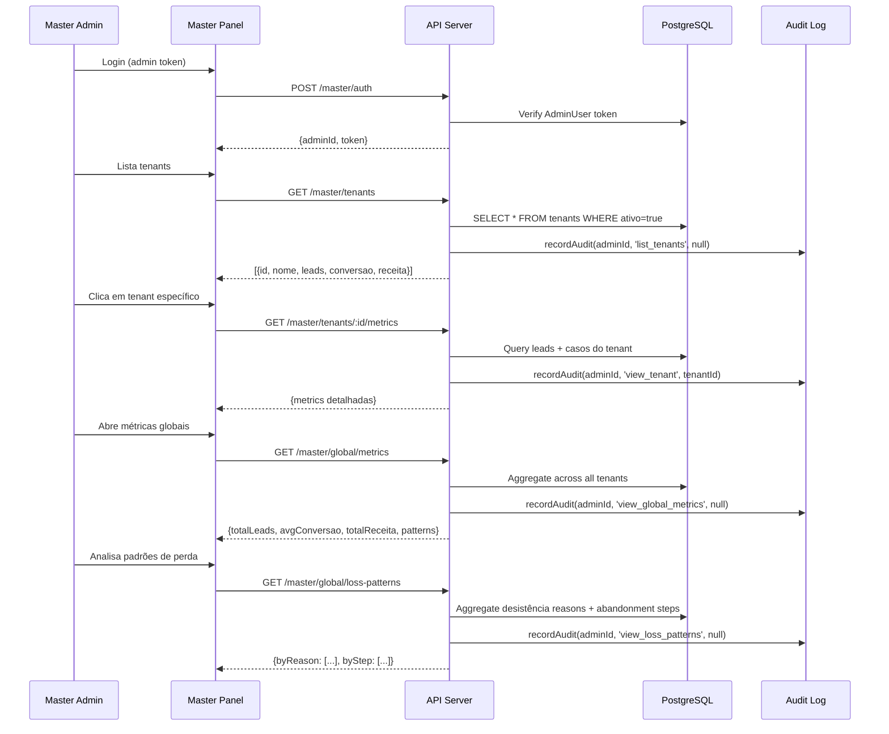

#### 🔴 Falhas Silenciosas — Jornada Master

| # | Ponto de Falha | Código Atual | Impacto | Mitigação |
|---|---------------|-------------|---------|-----------|
| F4.1 | **Audit Log não existe** | Nenhum modelo AdminLog no schema atual | Master acessa dados de clientes sem rastreabilidade — risco legal | Implementar AdminLog model + middleware obrigatório |
| F4.2 | **Admin token em variável de ambiente** | `ADMIN_TOKEN` ou random no boot | Token compartilhado, sem expiração, sem rotação | Migrar para AdminUser model com tokens individuais |
| F4.3 | **Agregação cross-tenant sem cache** | Não implementado | Query pesada em todos os tenants a cada request — performance degrada com escala | Cache de métricas globais com TTL 5min |
| F4.4 | **Sem rate limiting** | Nenhum rate limit nas rotas /master | Admin token vazado permite scraping de todos os dados | Rate limiting + IP whitelist para rotas master |

---

### Jornada 5: Sistema — Reativação de Leads Abandonados

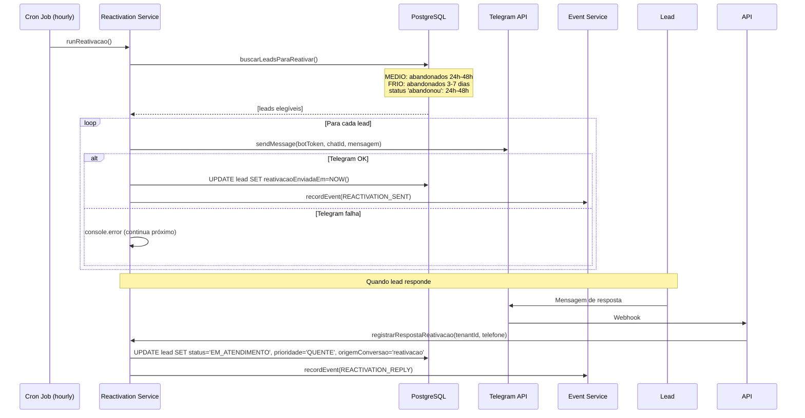

#### 🔴 Falhas Silenciosas — Jornada Reativação

| # | Ponto de Falha | Código Atual | Impacto | Mitigação |
|---|---------------|-------------|---------|-----------|
| F5.1 | **Telegram API falha silenciosamente** | `catch(err) { console.error(...) }` — continua próximo lead | Mensagem não enviada mas `reativacaoEnviadaEm` não é setado (OK), porém sem retry | Retry queue para mensagens falhadas + métrica de falha |
| F5.2 | **Lead com telefone inválido** | Não valida formato do telefone antes de enviar | Telegram retorna erro, lead nunca é reativado | Validação de telefone antes de tentar envio |
| F5.3 | **Cron não roda se Redis está down** | `if (STORAGE_ADAPTER === 'postgres' && REDIS_URL)` | Se Redis cai, cron para — leads abandonados nunca são reativados | Desacoplar cron do Redis — usar pg-boss ou cron independente |
| F5.4 | **`registrarRespostaReativacao` match por telefone** | `findFirst WHERE telefone AND reativacaoEnviadaEm NOT NULL` | Se lead tem múltiplos registros com mesmo telefone, pode atualizar o errado | Match por telefone + tenantId + ordenar por mais recente |
| F5.5 | **Sem limite de reativações** | Não verifica quantas vezes lead já foi reativado | Lead recebe mensagens repetidas — spam, bloqueio do bot | Adicionar campo `reativacaoCount` + limite máximo (ex: 2) |

---

### Jornada 6: Sistema — Detecção de Abandono

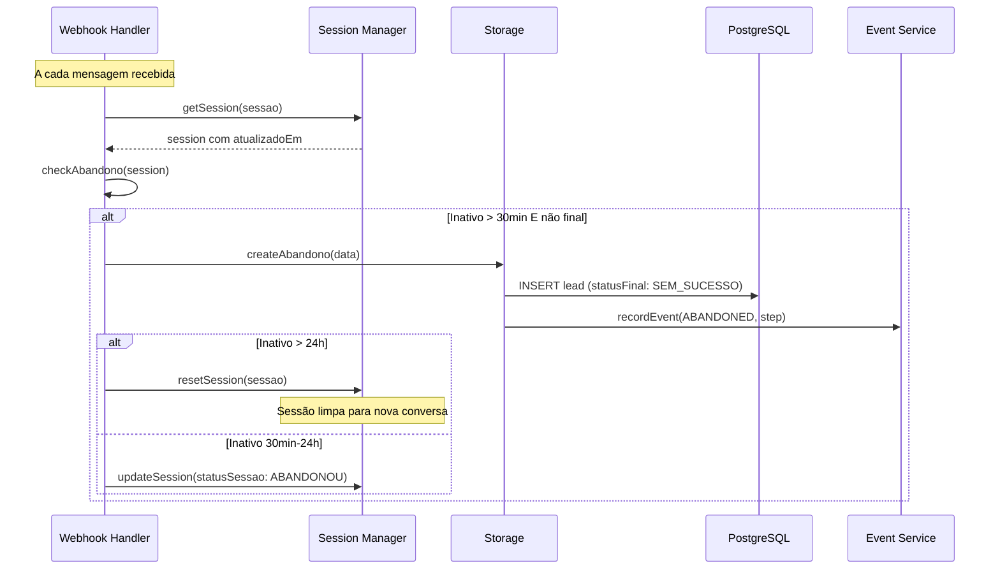

#### 🔴 Falhas Silenciosas — Jornada Abandono

| # | Ponto de Falha | Código Atual | Impacto | Mitigação |
|---|---------------|-------------|---------|-----------|
| F6.1 | **Abandono só detectado na próxima mensagem** | `checkAbandono` roda dentro do webhook handler | Se lead nunca mais manda mensagem, abandono nunca é detectado — **lead fantasma** | Job periódico (cron) que varre sessões inativas |
| F6.2 | **Classificação de abandono hardcoded** | `classificarAbandono` usa listas fixas de estados | Quando Flow Engine muda estados, classificação fica errada | Classificação baseada em metadata do Node (posição no fluxo) |
| F6.3 | **Abandono cria novo Lead** | `createAbandono` faz `prisma.lead.create` | Lead que abandonou gera registro duplicado — métricas infladas | Atualizar lead existente em vez de criar novo |
| F6.4 | **Session em memória perdida no restart** | Fallback para `inMemory` quando Redis falha | Servidor reinicia → todas as sessões perdidas → abandonos não detectados | Garantir Redis como source of truth, não fallback |

---

### Jornada 7: Sistema — SLA Engine e Attention Loop

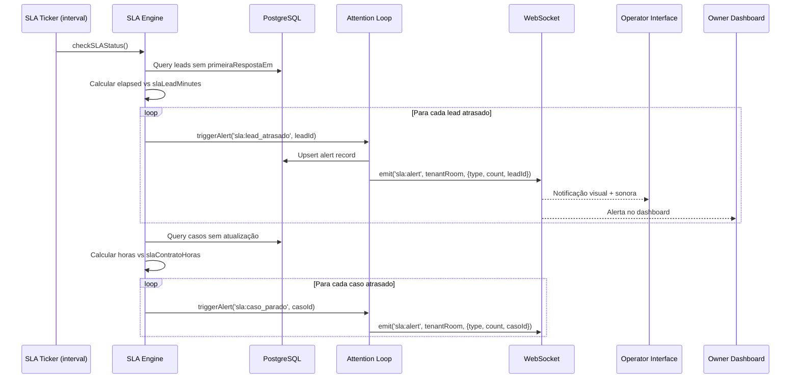

#### 🔴 Falhas Silenciosas — Jornada SLA

| # | Ponto de Falha | Código Atual | Impacto | Mitigação |
|---|---------------|-------------|---------|-----------|
| F7.1 | **SLA calculado on-the-fly, não proativo** | `slaStatus()` é chamado apenas quando lead é renderizado | Lead estoura SLA mas ninguém é notificado até abrir o dashboard | SLA Ticker periódico (a cada 1min) que emite alertas proativamente |
| F7.2 | **Sem SLA para Casos** | Código atual só tem SLA de lead (minutos) | Caso fica parado semanas sem ninguém perceber | Implementar `slaContratoHoras` no Tenant + check periódico |
| F7.3 | **Filas dinâmicas não existem** | Leads são ordenados por sort no frontend | Operador não vê fila "Leads sem resposta" separada de "Em atendimento" | Backend retorna filas pré-calculadas por categoria |
| F7.4 | **Config de SLA não propaga** | `slaMinutes` lido do tenant a cada query | Se tenant muda SLA, alertas antigos não são recalculados | Recalcular alertas ativos quando config muda |

---

### Jornada 8: Sistema — Conversão Lead → Caso

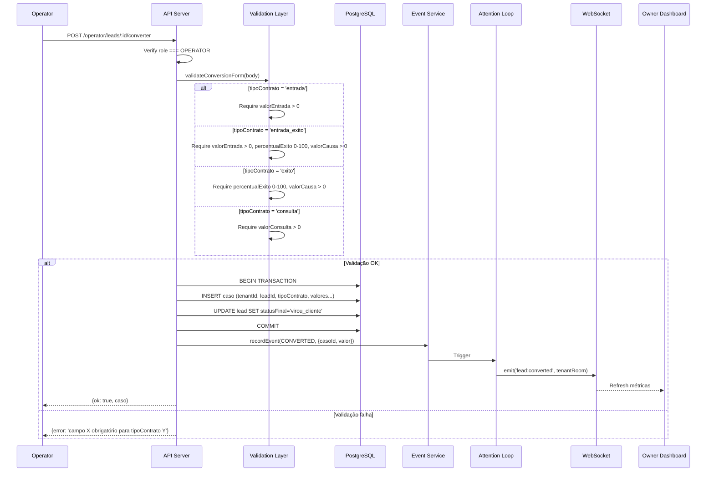

#### 🔴 Falhas Silenciosas — Jornada Conversão

| # | Ponto de Falha | Código Atual | Impacto | Mitigação |
|---|---------------|-------------|---------|-----------|
| F8.1 | **Sem transação atômica** | `markLeadOutcome` faz update sem transaction | Caso criado mas lead não atualizado (ou vice-versa) — dados inconsistentes | Prisma `$transaction` para criar Caso + atualizar Lead |
| F8.2 | **Conversion Form não existe** | `markLeadOutcome` aceita qualquer body | Lead convertido sem dados financeiros — receita = 0 | Implementar validação obrigatória por tipoContrato |
| F8.3 | **Sem modelo Caso** | Dados financeiros ficam no Lead | Não há separação entre receita real e estimada | Criar modelo Caso com lifecycle independente |
| F8.4 | **Evento CONVERTED pode falhar** | `safeRecordEvent` engole erros | Owner não vê conversão no dashboard em tempo real | Garantir evento com retry |


---

## Resumo Consolidado de Falhas Silenciosas

### Por Severidade

| Severidade | Falhas | Exemplos |
|-----------|--------|----------|
| 🔴 CRÍTICA | F1.3, F1.7, F2.2, F6.1, F6.3 | Lead perdido no queue, tenant isolation leak, conversion sem dados, abandono nunca detectado, leads duplicados |
| 🟠 ALTA | F1.4, F2.1, F2.5, F3.2, F4.1, F5.3, F7.1 | Eventos perdidos, WebSocket morto, race condition, auto-create tenant, cron parado, SLA não proativo |
| 🟡 MÉDIA | F1.2, F2.3, F2.6, F3.1, F3.5, F5.5, F6.2, F7.4 | Cache stale, SLA incorreto, sem motivo de perda, precisão decimal, config não propaga |
| 🔵 BAIXA | F1.1, F1.6, F3.6, F4.3, F5.2 | Redis fallback, normalizer, date filter, cache global, telefone inválido |

### Top 5 Ações Prioritárias

1. **Eliminar `global._currentTenantId`** → JWT-based tenant isolation (F1.7)
2. **Implementar Conversion Form obrigatório** → Dados financeiros garantidos (F2.2, F8.2)
3. **Job periódico de abandono** → Não depender de próxima mensagem (F6.1)
4. **Dead letter queue + alertas** → Leads nunca perdidos (F1.3)
5. **Audit Log para Master** → Rastreabilidade legal (F4.1)

---

## Components and Interfaces

### 1. Auth Module (`src/auth/`)

```typescript
// Interfaces conceituais (implementação em JS)

interface AuthService {
  // Owner/Operator login
  login(email: string, senha: string): Promise<{token: string, user: UserDTO}>
  
  // Verify JWT and extract claims
  verifyToken(token: string): Promise<{userId: string, tenantId: string, role: 'OWNER' | 'OPERATOR'}>
  
  // Master admin auth (separate flow)
  verifyAdminToken(token: string): Promise<{adminId: string}>
}

interface AuthMiddleware {
  // JWT middleware for Owner/Operator routes
  requireAuth(req, res, next): void
  
  // Role-based access
  requireRole(role: 'OWNER' | 'OPERATOR'): Middleware
  
  // Admin token middleware for Master routes
  requireAdmin(req, res, next): void
}
```

### 2. Flow Engine (`src/flow/`)

```typescript
interface FlowEngine {
  // Process a message through the dynamic flow
  process(tenantId: string, sessao: string, mensagem: string, canal: string): Promise<FlowResponse>
  
  // Load flow definition (with cache)
  getFlow(tenantId: string, flowId?: string): Promise<FlowDefinition>
  
  // Invalidate cache for a specific flow
  invalidateCache(tenantId: string, flowId: string): void
}

interface FlowDefinition {
  id: string
  tenantId: string
  objetivo: string  // 'leads', 'suporte', etc.
  nodes: Node[]
}

interface Node {
  id: string
  flowId: string
  estado: string        // unique within flow
  tipo: 'menu' | 'input' | 'final_lead' | 'final_cliente'
  mensagem: string
  opcoes: NodeOption[]
  ordem: number
}

interface NodeOption {
  texto: string         // user input to match
  proxEstado: string    // next state
  scoreIncrement: number
  segmento?: string
  tipoAtendimento?: string
}

interface FlowResponse {
  message: string
  estado: string
  fluxo: string
  sessao: string
  score: number
  prioridade: 'QUENTE' | 'MEDIO' | 'FRIO'
  flagAtencao: boolean
}
```

### 3. SLA Engine (`src/sla/`)

```typescript
interface SLAEngine {
  // Calculate SLA status for a lead
  leadSLAStatus(lead: Lead, tenant: Tenant, now?: Date): 'dentro' | 'atencao' | 'atrasado' | 'finalizado'
  
  // Calculate SLA status for a caso
  casoSLAStatus(caso: Caso, tenant: Tenant, now?: Date): 'dentro' | 'atencao' | 'atrasado' | 'finalizado'
  
  // Get all items exceeding SLA (for ticker)
  getViolations(tenantId: string): Promise<{leads: Lead[], casos: Caso[]}>
  
  // Check and emit alerts (called by ticker)
  tick(tenantId: string): Promise<Alert[]>
}

interface Alert {
  type: 'leads_sem_resposta' | 'contratos_parados' | 'queda_conversao'
  tenantId: string
  count: number
  items: string[]  // IDs
  severity: 'warning' | 'critical'
}
```

### 4. Conversion Service (`src/conversion/`)

```typescript
interface ConversionService {
  // Validate and execute lead → caso conversion
  convert(params: ConversionParams): Promise<{lead: Lead, caso: Caso}>
  
  // Validate conversion form fields
  validateForm(tipoContrato: string, data: ConversionData): ValidationResult
}

interface ConversionParams {
  tenantId: string
  leadId: string
  operatorId: string
  tipoContrato: 'entrada' | 'entrada_exito' | 'exito' | 'consulta' | 'outro'
  valorEntrada?: number
  percentualExito?: number
  valorCausa?: number
  valorConsulta?: number
  segmento?: string
  tipoProcesso?: string
}
```

### 5. Attention Loop (`src/attention/`)

```typescript
interface AttentionLoop {
  // Process an event and generate appropriate reactions
  handleEvent(event: SystemEvent): Promise<void>
  
  // Emit WebSocket events to appropriate rooms
  notify(tenantId: string, event: string, data: any): void
  
  // Update dynamic queues based on current state
  refreshQueues(tenantId: string): Promise<QueueState>
}

interface QueueState {
  leadsSemResposta: LeadDTO[]      // SLA estourado, sem primeiraRespostaEm
  emAtendimento: LeadDTO[]          // status = em_atendimento
  contratosEnviados: CasoDTO[]      // caso sem retorno > slaContratoHoras
  casosSemAtualizacao: CasoDTO[]    // caso stale
}
```

### 6. Metrics Aggregator (`src/metrics/`)

```typescript
interface MetricsAggregator {
  // Owner metrics (single tenant, with date filter)
  getOwnerMetrics(tenantId: string, periodo: DateRange): Promise<OwnerMetrics>
  
  // Master metrics (cross-tenant)
  getGlobalMetrics(): Promise<GlobalMetrics>
  
  // Tenant comparison for Master
  getTenantBenchmarks(): Promise<TenantBenchmark[]>
  
  // Loss pattern analysis
  getLossPatterns(tenantId?: string): Promise<LossPatterns>
}

interface OwnerMetrics {
  realRevenue: number       // sum(caso.valorRecebido) where dataRecebimento in period
  openRevenue: number       // sum(estimated) from active casos
  conversao: number         // leads virou_cliente / total leads
  leadsSemResposta: number  // count where SLA exceeded
  casosSemUpdate: number    // count where caso SLA exceeded
  tempoMedioResposta: number // avg(primeiraRespostaEm - criadoEm)
  alertas: Alert[]
  lucroEstimado: number     // realRevenue + openRevenue - custoMensal
}
```

### 7. API Route Groups

```
/auth/
  POST /login              → JWT (Owner/Operator)

/operator/                 → requireAuth + requireRole('OPERATOR')
  GET    /leads            → inbox com filas dinâmicas
  GET    /leads/:id        → detalhe + mensagens
  PATCH  /leads/:id/assumir → assumir atendimento
  POST   /leads/:id/messages → enviar mensagem humana
  POST   /leads/:id/converter → conversion form
  PATCH  /leads/:id/status → mudar status
  PATCH  /leads/:id/desistir → marcar desistência (com motivo)

/owner/                    → requireAuth + requireRole('OWNER')
  GET    /metrics          → dashboard metrics (com filtro de período)
  GET    /leads            → lista read-only
  GET    /leads/:id        → detalhe read-only
  GET    /casos            → lista de casos
  GET    /casos/:id        → detalhe do caso
  GET    /funil            → funnel analysis
  GET    /alerts           → alertas ativos
  GET    /tenant/config    → configuração
  PATCH  /tenant/config    → atualizar config

/master/                   → requireAdmin
  GET    /tenants          → lista de tenants
  GET    /tenants/:id/metrics → métricas de um tenant
  GET    /global/metrics   → métricas agregadas
  GET    /global/loss-patterns → padrões de perda
  GET    /global/benchmarks → comparação entre tenants
  GET    /audit-log        → log de auditoria
```

---

## Data Models

### Schema Evolution (Prisma)

```prisma
// ═══ NOVOS MODELOS ═══

model AdminUser {
  id       String   @id @default(uuid())
  email    String   @unique
  token    String   @unique
  ativo    Boolean  @default(true)
  criadoEm DateTime @default(now()) @map("criado_em")

  logs AdminLog[]
  @@map("admin_users")
}

model AdminLog {
  id        String   @id @default(uuid())
  adminId   String   @map("admin_id")
  acao      String
  tenantId  String?  @map("tenant_id")
  metadata  Json?
  criadoEm  DateTime @default(now()) @map("criado_em")

  admin AdminUser @relation(fields: [adminId], references: [id])

  @@index([adminId, criadoEm])
  @@index([tenantId, criadoEm])
  @@map("admin_logs")
}

model User {
  id        String   @id @default(uuid())
  tenantId  String   @map("tenant_id")
  email     String
  senhaHash String   @map("senha_hash")
  nome      String
  role      String   @default("OPERATOR")  // OWNER | OPERATOR
  ativo     Boolean  @default(true)
  criadoEm  DateTime @default(now()) @map("criado_em")

  tenant Tenant @relation(fields: [tenantId], references: [id])

  @@unique([tenantId, email])
  @@map("users")
}

model Caso {
  id               String    @id @default(uuid())
  tenantId         String    @map("tenant_id")
  leadId           String    @unique @map("lead_id")
  origem           String?
  segmento         String?
  tipoProcesso     String?   @map("tipo_processo")
  tipoContrato     String    @map("tipo_contrato")  // entrada, entrada_exito, exito, consulta, outro
  status           String    @default("em_andamento")
  valorEntrada     Decimal   @default(0) @map("valor_entrada") @db.Decimal(14, 2)
  percentualExito  Decimal   @default(0) @map("percentual_exito") @db.Decimal(5, 2)
  valorCausa       Decimal   @default(0) @map("valor_causa") @db.Decimal(14, 2)
  valorConsulta    Decimal   @default(0) @map("valor_consulta") @db.Decimal(14, 2)
  currency         String    @default("BRL")
  valorConvertido  Decimal?  @map("valor_convertido") @db.Decimal(14, 2)
  exchangeRate     Decimal?  @map("exchange_rate") @db.Decimal(10, 6)
  valorRecebido    Decimal?  @map("valor_recebido") @db.Decimal(14, 2)
  dataRecebimento  DateTime? @map("data_recebimento")
  criadoEm         DateTime  @default(now()) @map("criado_em")
  atualizadoEm     DateTime  @updatedAt @map("atualizado_em")

  tenant Tenant @relation(fields: [tenantId], references: [id])
  lead   Lead   @relation(fields: [leadId], references: [id])

  @@index([tenantId, status])
  @@index([tenantId, dataRecebimento])
  @@index([tenantId, criadoEm])
  @@map("casos")
}

model Node {
  id        String  @id @default(uuid())
  flowId    String  @map("flow_id")
  estado    String
  tipo      String  // menu, input, final_lead, final_cliente
  mensagem  String
  opcoes    Json    @default("[]")
  ordem     Int     @default(0)

  flow Flow @relation(fields: [flowId], references: [id])

  @@unique([flowId, estado])
  @@map("nodes")
}

// ═══ MODELOS ALTERADOS ═══

// Tenant: adicionar campos
//   slaContratoHoras  Int @default(48)
//   moedaBase         String @default("BRL")
//   flowSource        String @default("legacy")  // legacy | dynamic

// Lead: adicionar campos
//   assumidoPorId     String?   // userId do operador
//   primeiraRespostaEm DateTime?
//   segmento          String?
//   tipoAtendimento   String?
//   motivoDesistencia String?   // preco, sem_interesse, fechou_com_outro, nao_respondeu, outro
//   reativacaoCount   Int @default(0)

// Flow: adicionar relation
//   nodes Node[]
```

### Diagrama ER Simplificado

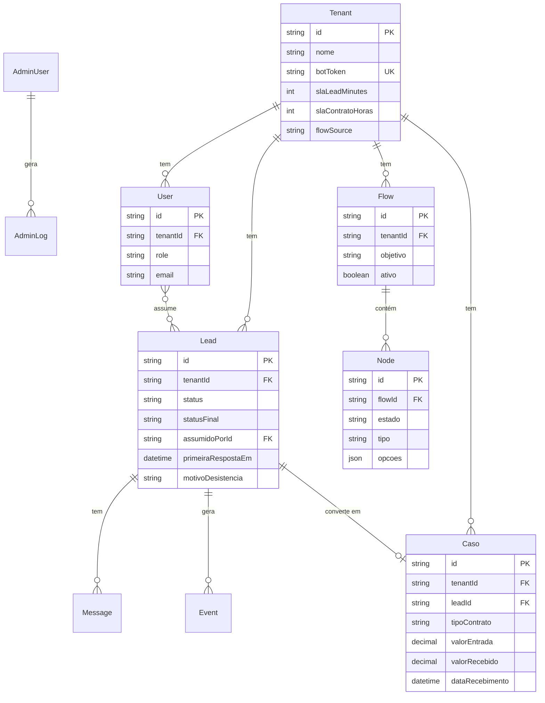


---

## Correctness Properties

*A property is a characteristic or behavior that should hold true across all valid executions of a system — essentially, a formal statement about what the system should do. Properties serve as the bridge between human-readable specifications and machine-verifiable correctness guarantees.*

### Property 1: Tenant Data Isolation

*For any* two distinct tenants A and B, querying leads, cases, messages, or events for tenant A SHALL never return records belonging to tenant B, regardless of the query parameters used.

**Validates: Requirements 1.1**

### Property 2: JWT Claims Completeness

*For any* valid user (Owner or Operator), the JWT issued at login SHALL contain exactly three claims: userId, tenantId, and role, where role is one of 'OWNER' or 'OPERATOR', and all values are non-empty strings.

**Validates: Requirements 1.3**

### Property 3: Role-Based Access Control

*For any* authenticated user with role R attempting to access a route requiring role R', where R ≠ R', the system SHALL return HTTP 403. *For any* request with an invalid or expired JWT, the system SHALL return HTTP 401.

**Validates: Requirements 1.5, 1.6, 1.7, 16.1, 16.2, 16.3, 16.4**

### Property 4: Audit Log Completeness

*For any* action performed by a Master admin (view tenant, view metrics, access client data), the AdminLog table SHALL contain a record with the correct adminId, action name, target tenantId, and a timestamp within 1 second of the action.

**Validates: Requirements 2.3, 20.5**

### Property 5: Global Metrics Aggregation

*For any* set of active tenants with leads and cases, the global metrics SHALL equal: total leads = sum of all tenant lead counts, overall conversion rate = total converted / total leads, total revenue = sum of all tenant revenues, and average response time = weighted average across tenants.

**Validates: Requirements 2.5, 2.6, 20.2**

### Property 6: Date-Filtered Metrics

*For any* date range filter (today, this week, this month, custom) and any set of leads/cases, the returned metrics SHALL include only records where criadoEm falls within the specified range, and SHALL exclude all records outside that range.

**Validates: Requirements 3.2**

### Property 7: Real Revenue Calculation

*For any* set of Casos where both valorRecebido and dataRecebimento are non-null and dataRecebimento falls within the selected period, Real_Revenue SHALL equal the sum of valorRecebido across those Casos.

**Validates: Requirements 3.3, 6.2**

### Property 8: Open Revenue Calculation

*For any* set of active Casos (status ≠ "finalizado" and valorRecebido is null), Open_Revenue SHALL equal the sum of (valorEntrada + (percentualExito / 100 × valorCausa) + valorConsulta) for each Caso.

**Validates: Requirements 3.4, 6.3, 19.4**

### Property 9: Conversion Percentage

*For any* set of leads within a period, the conversion percentage SHALL equal (count of leads with statusFinal = "virou_cliente") / (total lead count in period), expressed as a value between 0 and 1.

**Validates: Requirements 3.5**

### Property 10: Lead SLA Status Calculation

*For any* lead and tenant configuration, the SLA status SHALL be: "finalizado" if statusFinal is set, "atrasado" if primeiraRespostaEm is null AND elapsed minutes since criadoEm ≥ slaLeadMinutes, "atencao" if primeiraRespostaEm is null AND elapsed ≥ 70% of slaLeadMinutes, and "dentro" otherwise. A lead with primeiraRespostaEm set SHALL never have status "atrasado".

**Validates: Requirements 8.1, 8.2, 8.6**

### Property 11: Caso SLA Status Calculation

*For any* Caso and tenant configuration, the SLA status SHALL be calculated based on hours since atualizadoEm versus slaContratoHoras, following the same threshold logic as lead SLA (70% = atencao, 100% = atrasado).

**Validates: Requirements 8.3**

### Property 12: Alert Generation

*For any* tenant state, alerts SHALL be generated as follows: "leads_sem_resposta" when count of leads with SLA status "atrasado" > 0, "contratos_parados" when count of Casos with SLA status "atrasado" > 0, and "queda_conversao" when conversion rate < 10%. Each alert SHALL include the correct count of affected items.

**Validates: Requirements 3.9, 3.10, 3.11**

### Property 13: Lead Inbox Sort Order

*For any* set of leads, the inbox sort order SHALL be: SLA-exceeded leads first (atrasado < atencao < dentro < finalizado), then by score descending within each SLA group, then by oldest criadoEm within each score group.

**Validates: Requirements 4.2**

### Property 14: Desistência Requires Reason

*For any* attempt to set a lead status to "desistiu", if motivoDesistencia is not provided or is not one of ["preco", "sem_interesse", "fechou_com_outro", "nao_respondeu", "outro"], the system SHALL reject the request. If a valid reason is provided, the system SHALL accept the request.

**Validates: Requirements 4.7, 4.8**

### Property 15: Conversion Form Validation

*For any* tipoContrato, the system SHALL require exactly the fields specified: "entrada" requires valorEntrada > 0; "entrada_exito" requires valorEntrada > 0, percentualExito in [0,100], and valorCausa > 0; "exito" requires percentualExito in [0,100] and valorCausa > 0; "consulta" requires valorConsulta > 0. Missing required fields SHALL produce an error identifying the missing field.

**Validates: Requirements 5.1, 5.2, 5.3, 5.4, 5.5**

### Property 16: Conversion Atomicity

*For any* valid conversion form submission, the system SHALL atomically create a Caso with status "em_andamento" AND update the lead statusFinal to "virou_cliente". If either operation fails, neither SHALL be persisted.

**Validates: Requirements 5.6, 5.7**

### Property 17: Caso Closing Requires Payment Data

*For any* attempt to close a Caso (set status to "finalizado"), the system SHALL require both valorRecebido > 0 and dataRecebimento as a valid date. Missing either field SHALL result in rejection.

**Validates: Requirements 6.4**

### Property 18: Currency Conversion

*For any* Caso with currency ≠ tenant moedaBase and a provided exchangeRate > 0, valorConvertido SHALL equal valorRecebido × exchangeRate.

**Validates: Requirements 6.5**

### Property 19: Flow Engine State Resolution

*For any* Node of tipo "menu" with opcoes array and any user input, the Flow Engine SHALL: if input matches an opcoes[].texto, advance to that option's proxEstado with the specified scoreIncrement; if no match, remain on the current state. *For any* Node of tipo "input", the engine SHALL advance to opcoes[0].proxEstado, with "final_lead" as fallback if opcoes is empty.

**Validates: Requirements 7.2, 7.3, 7.4**

### Property 20: Dynamic Queue Membership

*For any* tenant state, the four queues SHALL contain exactly: "Leads sem resposta" = leads where primeiraRespostaEm is null AND SLA status is "atrasado"; "Atendimento em andamento" = leads where status is "em_atendimento"; "Contratos enviados sem retorno" = Casos where hours since last update > slaContratoHoras; "Casos sem atualização" = Casos where status ≠ "finalizado" AND hours since update > slaContratoHoras.

**Validates: Requirements 8.4**

### Property 21: Reactivation Eligibility

*For any* set of leads, the reactivation eligibility filter SHALL return exactly: MEDIO priority leads with abandonedAt between 24h and 48h ago, FRIO priority leads with abandonedAt between 3 and 7 days ago, and leads with status "abandonou" created between 24h and 48h ago — excluding leads where reativacaoEnviadaEm is already set.

**Validates: Requirements 11.1**

### Property 22: Reactivation Response Handling

*For any* lead that responds to a reactivation message, the system SHALL set status to "EM_ATENDIMENTO", clear statusFinal, set prioridade to "QUENTE", set origemConversao to "reativacao", and record reativacaoRespondidaEm.

**Validates: Requirements 11.4**

### Property 23: Flow Event Tracking Round-Trip

*For any* flow transition (step entry, abandonment, or completion), the system SHALL record an Event with the correct type ("entered_step", "abandoned", or "completed_flow") and the step name. Querying events for a lead SHALL return all recorded transitions in chronological order.

**Validates: Requirements 15.1, 15.2, 15.3**

### Property 24: Funnel Aggregation

*For any* set of abandonment events, the funnel analysis SHALL return steps sorted by abandonment count descending, where each step's count equals the number of events with type "abandoned" and that step name.

**Validates: Requirements 15.4**

### Property 25: Conversion Rate Per Priority Band

*For any* set of leads, the conversion rate per priority band SHALL equal (count of leads with that priority AND statusFinal = "virou_cliente") / (total leads with that priority), calculated independently for QUENTE, MEDIO, and FRIO.

**Validates: Requirements 15.5**

### Property 26: Abandonment Detection by Inactivity

*For any* session with no activity for ≥ 30 minutes in a non-final state, the system SHALL mark it as "ABANDONOU" and create an abandonment record. *For any* session with no activity for ≥ 24 hours, the system SHALL additionally reset the session to initial state.

**Validates: Requirements 18.1, 18.2**

### Property 27: Abandonment Classification

*For any* abandonment at a given state, the classification SHALL be: "PRECOCE" if the state is an initial state (start, fallback), "VALIOSO" if the state is a contact collection state (coleta_nome, contato_*), and "MEDIO" for all other intermediate states.

**Validates: Requirements 18.3**

### Property 28: Empty Input Rejection

*For any* string composed entirely of whitespace (including empty string), the system SHALL reject it as a message with error "texto é obrigatório".

**Validates: Requirements 13.4**

### Property 29: Message Chronological Order

*For any* set of messages for a lead, the messages SHALL be returned sorted by criadoEm ascending, and each message SHALL include direcao (cliente/bot/humano) and criadoEm timestamp.

**Validates: Requirements 13.3**

### Property 30: SLA Config Validation

*For any* attempt to update slaLeadMinutes or slaContratoHoras, the system SHALL reject values that are not positive integers (≤ 0, decimals, non-numeric).

**Validates: Requirements 14.3**


---

## Error Handling

### Estratégia por Camada

| Camada | Estratégia | Exemplo |
|--------|-----------|---------|
| **API Gateway** | Retorna HTTP status code + JSON error body | `{ error: "Token inválido ou expirado" }` |
| **Auth Middleware** | 401 para token inválido, 403 para role insuficiente | Middleware chain: verifyJWT → checkRole → handler |
| **Flow Engine** | Fallback para estado atual (repete pergunta) | Input inválido → mesmo Node, mesma mensagem |
| **Storage** | Retry com backoff exponencial (3 tentativas) | BullMQ job retry: 2s, 4s, 8s |
| **Event Service** | Fire-and-forget com log (migrar para retry queue) | `safeRecordEvent` → event bus com DLQ |
| **WebSocket** | Reconnect automático (5 tentativas) + heartbeat | Client-side reconnection + server ping/pong |
| **External APIs** | Timeout + retry + circuit breaker | Telegram API: 8s timeout, 3 retries |
| **Cron Jobs** | Try/catch por item, continua próximo | Reativação: erro em 1 lead não para o batch |

### Error Codes Padronizados

```javascript
const ERRORS = {
  // Auth
  TOKEN_INVALID:     { status: 401, code: 'AUTH_001', message: 'Token inválido ou expirado' },
  ACCESS_DENIED:     { status: 403, code: 'AUTH_002', message: 'Acesso negado' },
  
  // Validation
  FIELD_REQUIRED:    { status: 400, code: 'VAL_001', message: 'Campo {field} é obrigatório' },
  FIELD_INVALID:     { status: 400, code: 'VAL_002', message: 'Campo {field} inválido: {reason}' },
  REASON_REQUIRED:   { status: 400, code: 'VAL_003', message: 'Motivo obrigatório para desistência' },
  
  // Business
  LEAD_NOT_FOUND:    { status: 404, code: 'BIZ_001', message: 'Lead não encontrado' },
  CASO_NOT_FOUND:    { status: 404, code: 'BIZ_002', message: 'Caso não encontrado' },
  TENANT_NOT_FOUND:  { status: 404, code: 'BIZ_003', message: 'Tenant não encontrado' },
  LEAD_ALREADY_TAKEN:{ status: 409, code: 'BIZ_004', message: 'Lead já assumido por outro operador' },
  
  // System
  DB_ERROR:          { status: 500, code: 'SYS_001', message: 'Erro de banco de dados' },
  QUEUE_ERROR:       { status: 500, code: 'SYS_002', message: 'Erro na fila de processamento' },
  EXTERNAL_API:      { status: 502, code: 'SYS_003', message: 'Erro na API externa' },
};
```

### Dead Letter Queue (DLQ)

Para jobs que falham após todas as tentativas:

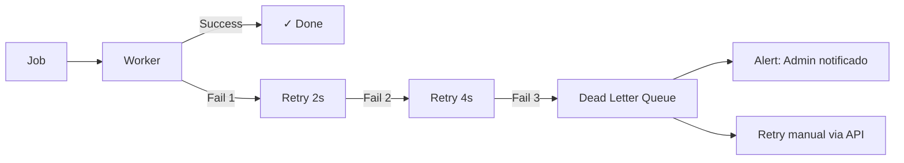

### Graceful Degradation

| Componente Down | Comportamento | Fallback |
|----------------|--------------|----------|
| Redis | Sessions fallback para memória | Log warning, funciona com limitações |
| PostgreSQL | API retorna 503 | Health check reporta "degraded" |
| BullMQ | Jobs não enfileirados | Persistência síncrona direta |
| Telegram API | Mensagem não enviada | Retry queue, log para reenvio manual |
| WebSocket | Client não recebe updates | Polling automático a cada 30s |

---

## Testing Strategy

### Abordagem Dual: Unit Tests + Property-Based Tests

Este projeto usa uma abordagem dual de testes:

- **Unit tests (Jest)**: Exemplos específicos, edge cases, integrações
- **Property-based tests (fast-check)**: Propriedades universais com 100+ iterações

### Property-Based Testing Setup

Library: **fast-check** (JavaScript PBT library)
Runner: **Jest**
Minimum iterations: **100 per property**

Cada property test deve referenciar a propriedade do design document:

```javascript
// Tag format:
// Feature: bro-resolve-saas, Property {N}: {title}

const fc = require('fast-check');

describe('Feature: bro-resolve-saas, Property 10: Lead SLA Status Calculation', () => {
  it('should correctly calculate SLA status for any lead and tenant config', () => {
    fc.assert(
      fc.property(
        arbitraryLead(),
        arbitraryTenantConfig(),
        fc.date(),
        (lead, tenant, now) => {
          const status = leadSLAStatus(lead, tenant, now);
          // ... assertions
        }
      ),
      { numRuns: 100 }
    );
  });
});
```

### Test Categories

| Categoria | Tipo | Cobertura |
|-----------|------|-----------|
| Tenant isolation | Property (P1) | Queries never leak cross-tenant |
| JWT/Auth | Property (P2, P3) | Token structure, role enforcement |
| Revenue calculations | Property (P7, P8, P9) | Real/Open revenue, conversion % |
| SLA calculations | Property (P10, P11) | Lead/Caso SLA status |
| Alert generation | Property (P12) | Correct alerts for tenant state |
| Sort/ordering | Property (P13, P29) | Inbox sort, message order |
| Validation | Property (P14, P15, P28, P30) | Form validation, input rejection |
| Conversion atomicity | Property (P16) | Caso + Lead atomic update |
| Flow Engine | Property (P19) | State resolution from Node graph |
| Queue membership | Property (P20) | Dynamic queue contents |
| Reactivation | Property (P21, P22) | Eligibility filter, response handling |
| Abandonment | Property (P26, P27) | Detection thresholds, classification |
| Funnel | Property (P24, P25) | Aggregation, per-priority rates |
| Audit | Property (P4) | Log completeness |
| Metrics aggregation | Property (P5, P6) | Global metrics, date filtering |
| Currency | Property (P18) | Exchange rate calculation |
| WebSocket events | Integration | Event delivery to correct rooms |
| Telegram API | Integration | Message send/receive with mocks |
| Health check | Smoke | Endpoint returns correct status |
| Schema | Smoke | All models and indexes exist |

### Unit Test Focus Areas

- Specific examples for each conversion tipoContrato
- Edge cases: zero values, negative values, null fields
- Integration: WebSocket event delivery
- Error paths: DB down, Redis down, Telegram timeout
- Regression: current `stateMachine.js` behavior preserved during migration

### Integration Test Focus Areas

- Full webhook → Flow Engine → persist → event → WebSocket pipeline
- Auth flow: login → JWT → protected route → response
- Reactivation: cron → query → send → response → update
- SLA ticker: check → alert → WebSocket → UI notification

