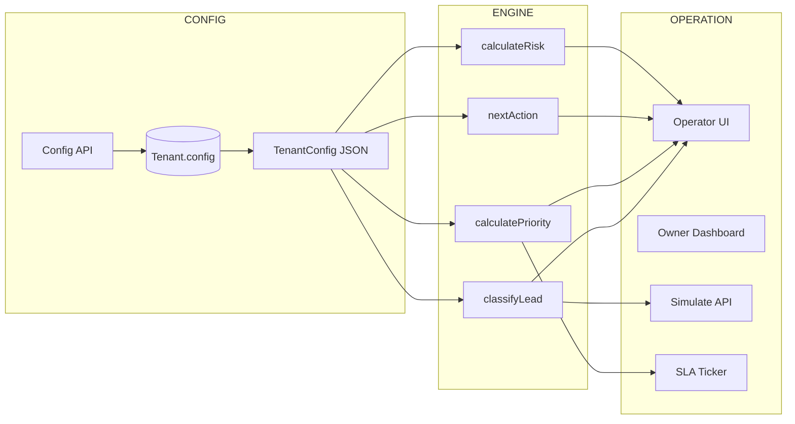
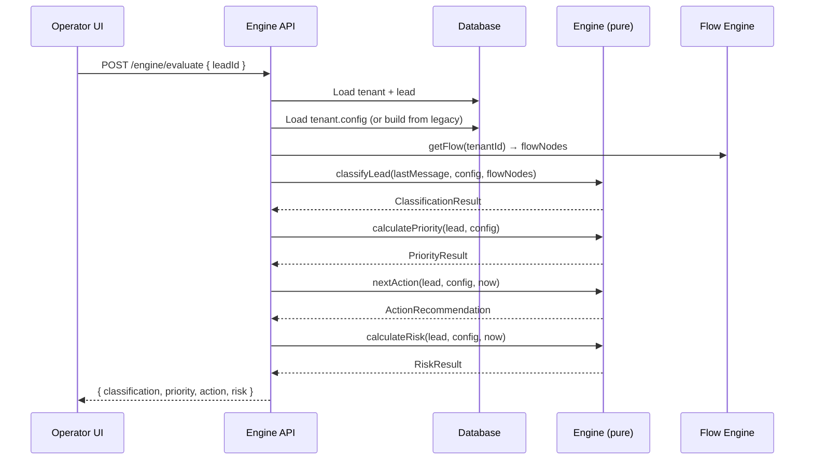

# Design Document — CONFIG → ENGINE → OPERATION

## Overview

This design refactors the BRO Revenue SaaS from scattered hardcoded values into a clean CONFIG → ENGINE → OPERATION architecture. Today, business logic lives in multiple files with fixed values: pipeline stages in `constants.js`, keyword maps in `simulate.js`, priority thresholds in `calcularPrioridade`, and SLA limits read directly from individual Tenant fields. This works for Santos & Bastos (advocacia) but breaks the multi-tenant SaaS promise.

The refactoring introduces:
1. **TenantConfig** — a unified JSON object stored in `Tenant.config` that holds all business rules
2. **Engine** — 4 pure functions (`classifyLead`, `calculatePriority`, `nextAction`, `calculateRisk`) in `src/engine/` that take data + config and return deterministic results
3. **Operation** — the existing operator/owner UI and API layers that consume Engine outputs instead of computing logic themselves

The Flow Engine (`src/flow/engine.js`) stays untouched. Existing API contracts and the 312 tests continue to pass via a backward-compatible migration layer that builds a default TenantConfig from legacy fields.



## Architecture

### Module Layout

```
src/
  engine/
    index.js          # Re-exports all 4 functions
    classify.js       # classifyLead pure function
    priority.js       # calculatePriority pure function
    action.js         # nextAction pure function
    risk.js           # calculateRisk pure function
    config.js         # TenantConfig schema, defaults, buildConfigFromLegacy
  pipeline/
    constants.js      # KEPT — delegates to engine when config available
  sla/
    engine.js         # MODIFIED — reads from TenantConfig slaRules
  api/
    engine.js         # NEW — POST /engine/evaluate, POST /engine/simulate
    operator.js       # MODIFIED — uses engine functions
    owner.js          # MODIFIED — adds GET/PATCH /owner/config for TenantConfig
    simulate.js       # MODIFIED — delegates to engine.classifyLead
  flow/
    engine.js         # UNTOUCHED
```

### Key Design Decisions

1. **Pure functions over classes**: All 4 engine functions are pure — they receive all inputs as arguments and return deterministic results. No database access, no side effects. This makes them trivially testable and composable.

2. **Backward compatibility via `buildConfigFromLegacy`**: A single function in `src/engine/config.js` constructs a TenantConfig from the existing scattered Tenant fields. This means every existing code path works without changes — the config is built on-the-fly when `Tenant.config` is null.

3. **Prisma schema addition, not migration**: We add a `config Json?` field to the Tenant model. Existing tenants have `config: null` and get the legacy-built config. New tenants created via onboarding get a full TenantConfig stored in `config`.

4. **constants.js stays as a facade**: The existing exports (`PIPELINE`, `calcularPrioridade`, `nextStage`, etc.) remain functional. They serve as the default values and are used by code that doesn't have a TenantConfig in scope. The engine functions are the new primary API.

5. **Flow Engine untouched**: `src/flow/engine.js` continues to handle message processing. The Engine's `classifyLead` reads flow nodes for keyword matching but doesn't modify the flow system.

## Components and Interfaces

### 1. TenantConfig Builder (`src/engine/config.js`)

```javascript
/**
 * Build a TenantConfig from legacy Tenant fields.
 * Used when tenant.config is null (backward compatibility).
 * 
 * @param {object} tenant - Prisma Tenant record
 * @returns {TenantConfig}
 */
function buildConfigFromLegacy(tenant) { ... }

/**
 * Resolve the TenantConfig for a tenant.
 * Returns tenant.config if present, otherwise builds from legacy fields.
 * 
 * @param {object} tenant - Prisma Tenant record
 * @returns {TenantConfig}
 */
function resolveConfig(tenant) { ... }

/**
 * Validate a partial TenantConfig update.
 * Returns { valid: boolean, errors: string[] }
 */
function validateConfigUpdate(partial) { ... }

/** Default TenantConfig matching current hardcoded behavior */
const DEFAULT_CONFIG = { ... };
```

### 2. Engine Functions (`src/engine/`)

```javascript
// classify.js
/**
 * @param {string} message
 * @param {TenantConfig} config
 * @param {Array} flowNodes - from Flow Engine
 * @returns {ClassificationResult}
 */
function classifyLead(message, config, flowNodes) { ... }

// priority.js
/**
 * @param {object} lead - lead data object
 * @param {TenantConfig} config
 * @returns {PriorityResult}
 */
function calculatePriority(lead, config) { ... }

// action.js
/**
 * @param {object} lead - lead data object
 * @param {TenantConfig} config
 * @param {Date} now
 * @returns {ActionRecommendation}
 */
function nextAction(lead, config, now) { ... }

// risk.js
/**
 * @param {object} lead - lead data object
 * @param {TenantConfig} config
 * @param {Date} now
 * @returns {RiskResult}
 */
function calculateRisk(lead, config, now) { ... }
```

### 3. Config API (added to `src/api/owner.js`)

```
GET  /owner/config          → returns full TenantConfig
PATCH /owner/config         → merges partial update into TenantConfig
GET  /owner/config?tenantId → MASTER can read any tenant's config
```

### 4. Engine API (`src/api/engine.js`)

```
POST /engine/evaluate   { leadId }    → { classification, priority, action, risk }
POST /engine/simulate   { message }   → { classification, priority }
```

### 5. Modified Modules

| Module | Change |
|--------|--------|
| `src/pipeline/constants.js` | `calcularPrioridade` gains optional `config` param; without it, uses hardcoded defaults |
| `src/sla/engine.js` | `leadSLAStatus`/`casoSLAStatus` gain optional `config` param; reads slaRules from config |
| `src/api/simulate.js` | Replaces KEYWORD_MAP/VALORES with calls to `classifyLead`/`calculatePriority`/`calculateRisk` |
| `src/api/operator.js` | Stage/activity validation uses config's pipelineStages; priority recalc uses engine |
| `dashboard/src/components/OperatorInterface.jsx` | Fetches config for dynamic STAGE_OPTIONS/ACTIVITY_OPTIONS; shows engine recommendations |
| `dashboard/src/components/ConfigPage.jsx` | Reads/writes TenantConfig via new endpoints; adds pipeline editor and priority preview |
| `dashboard/src/components/OnboardingWizard.jsx` | Generates full TenantConfig on account creation |

## Data Models

### TenantConfig JSON Schema

```json
{
  "businessType": "advocacia",
  "segmentos": [
    {
      "nome": "trabalhista",
      "valorMin": 2000,
      "valorMax": 15000,
      "ticketMedio": 5000,
      "taxaConversao": 0.25,
      "keywords": ["trabalho", "demitido", "demissão", "trabalhista"]
    }
  ],
  "pipelineStages": [
    { "name": "novo", "defaultActivityStatus": "novo", "isFinal": false },
    { "name": "atendimento", "defaultActivityStatus": "em_atendimento", "isFinal": false },
    { "name": "qualificado", "defaultActivityStatus": "em_atendimento", "isFinal": false },
    { "name": "proposta", "defaultActivityStatus": "aguardando_cliente", "isFinal": false },
    { "name": "negociacao", "defaultActivityStatus": "em_negociacao", "isFinal": false },
    { "name": "convertido", "defaultActivityStatus": null, "isFinal": true },
    { "name": "perdido", "defaultActivityStatus": null, "isFinal": true }
  ],
  "activityRules": {
    "novo": "novo",
    "atendimento": "em_atendimento",
    "qualificado": "em_atendimento",
    "proposta": "aguardando_cliente",
    "negociacao": "em_negociacao",
    "convertido": null,
    "perdido": null
  },
  "slaRules": {
    "leadResponseMinutes": 15,
    "contratoUpdateHoras": 48,
    "attentionThresholdPercent": 70
  },
  "priorityThresholds": {
    "rules": [
      { "condition": { "activityStatus": "sem_resposta" }, "scoreIncrement": 5 },
      { "condition": { "activityStatus": "follow_up" }, "scoreIncrement": 3 },
      { "condition": { "estagio": "proposta" }, "scoreIncrement": 3 },
      { "condition": { "estagio": "negociacao" }, "scoreIncrement": 3 },
      { "condition": { "valorMinimo": 5000 }, "scoreIncrement": 2 },
      { "condition": { "valorMinimo": 2000 }, "scoreIncrement": 1 }
    ],
    "quente": 6,
    "medio": 3
  },
  "canais": {
    "whatsappEnabled": false,
    "telegramEnabled": true
  }
}
```

### Prisma Schema Change

```prisma
model Tenant {
  // ... existing fields ...
  config  Json?  // TenantConfig JSON, null for legacy tenants
}
```

### Return Types

```typescript
// ClassificationResult
{
  segmento: string;
  matchedKeywords: string[];
  explicacao: string;
  source: 'flow_engine' | 'segment_match' | 'fallback';
}

// PriorityResult
{
  prioridade: 'quente' | 'medio' | 'frio';
  score: number;
  reason: string;  // e.g. "sem_resposta +5, proposta +3 = 8 → quente"
}

// ActionRecommendation
{
  actionText: string;
  urgency: 'critico' | 'alto' | 'normal' | 'baixo';
  contextText: string;
}

// RiskResult
{
  valorEmRisco: number;
  urgencyLevel: 'critico' | 'alto' | 'normal';
  tempoRestante: number;  // minutes until SLA breach
}
```

### Data Flow: CONFIG → ENGINE → OPERATION



### Migration Strategy

1. **Phase 1 — Add `config` field**: Prisma migration adds nullable `config Json?` to Tenant. All existing tenants have `config: null`.
2. **Phase 2 — Engine module**: Create `src/engine/` with pure functions. `resolveConfig(tenant)` returns `tenant.config || buildConfigFromLegacy(tenant)`.
3. **Phase 3 — Wire up**: API endpoints and SLA ticker call engine functions, passing resolved config. `constants.js` exports remain as-is for backward compat.
4. **Phase 4 — Onboarding**: New tenants created via OnboardingWizard get a full TenantConfig stored in `config`.
5. **Phase 5 — Frontend**: ConfigPage reads/writes TenantConfig. OperatorInterface shows engine recommendations.

No data migration needed. Existing tenants work via `buildConfigFromLegacy`. When an owner edits config via ConfigPage, the full TenantConfig is written to `config` and legacy fields are also updated for backward compat.


## Correctness Properties

*A property is a characteristic or behavior that should hold true across all valid executions of a system — essentially, a formal statement about what the system should do. Properties serve as the bridge between human-readable specifications and machine-verifiable correctness guarantees.*

### Property 1: TenantConfig structural validity and internal consistency

*For any* valid TenantConfig object, it SHALL contain all required top-level keys (businessType, segmentos, pipelineStages, activityRules, slaRules, priorityThresholds, canais), AND every stage name in pipelineStages SHALL have a corresponding key in activityRules.

**Validates: Requirements 1.1, 1.6**

### Property 2: Legacy config construction preserves tenant values

*For any* Tenant record with legacy fields (slaMinutes, segmentos, ticketMedio, taxaConversao, slaContratoHoras, moeda), calling `buildConfigFromLegacy(tenant)` SHALL produce a valid TenantConfig where `slaRules.leadResponseMinutes` equals `tenant.slaMinutes`, `slaRules.contratoUpdateHoras` equals `tenant.slaContratoHoras`, and the segmentos array preserves all segment names and values from the tenant's legacy segmentos field.

**Validates: Requirements 1.2, 2.1**

### Property 3: Backward-compatible priority scores

*For any* lead object with arbitrary activityStatus, estagio, and valorEstimado, calling `calculatePriority(lead, defaultConfig)` SHALL produce the same prioridade value as the current hardcoded `calcularPrioridade(lead)` function from `constants.js`.

**Validates: Requirements 2.3, 4.5**

### Property 4: Engine functions return structurally complete results

*For any* valid inputs, each engine function SHALL return an object with all required fields: `classifyLead` returns {segmento, matchedKeywords, explicacao, source}; `calculatePriority` returns {prioridade, score, reason}; `nextAction` returns {actionText, urgency, contextText}; `calculateRisk` returns {valorEmRisco, urgencyLevel, tempoRestante}.

**Validates: Requirements 3.1, 4.1, 5.1, 6.1**

### Property 5: Engine functions are deterministic (pure)

*For any* set of inputs, calling any engine function twice with identical arguments SHALL produce identical output. Specifically: `classifyLead(msg, config, nodes)` called twice returns the same ClassificationResult, and likewise for `calculatePriority`, `nextAction`, and `calculateRisk`.

**Validates: Requirements 3.4, 4.4, 5.4, 6.5**

### Property 6: Classification source priority

*For any* message, TenantConfig, and flow nodes array, if a flow node keyword matches the message, the ClassificationResult source SHALL be `'flow_engine'`. If no flow node matches but a segment name matches, source SHALL be `'segment_match'`. If neither matches, source SHALL be `'fallback'` and segmento SHALL be `'outros'`.

**Validates: Requirements 3.2, 3.3**

### Property 7: Classification round-trip consistency

*For any* valid message that classifies to a non-fallback segmento, the ClassificationResult's explicacao text, when re-classified, SHALL produce the same segmento as the original classification.

**Validates: Requirements 3.5**

### Property 8: Priority score computation follows config rules

*For any* lead object and TenantConfig, the score returned by `calculatePriority` SHALL equal the sum of `scoreIncrement` values from all matching rules in `priorityThresholds.rules`, AND the prioridade SHALL be `'quente'` when score >= `priorityThresholds.quente`, `'medio'` when score >= `priorityThresholds.medio`, and `'frio'` otherwise.

**Validates: Requirements 4.2, 4.3**

### Property 9: Critical urgency for unresponsive valuable leads

*For any* lead with `activityStatus === 'sem_resposta'` and `valorEstimado > 0`, and any TenantConfig, calling `nextAction` SHALL return `urgency === 'critico'` and the `actionText` SHALL contain a string representation of the financial value.

**Validates: Requirements 5.3**

### Property 10: nextAction respects config pipeline stages

*For any* lead and TenantConfig with custom pipelineStages, the stage recommended by `nextAction` (if any) SHALL be a stage name present in the config's pipelineStages array, not from the hardcoded PIPELINE constant.

**Validates: Requirements 5.5**

### Property 11: Risk calculation correctness

*For any* lead and TenantConfig, `calculateRisk` SHALL set `valorEmRisco` to `lead.valorEstimado` when it is > 0, or to the matching segment's `ticketMedio` from config otherwise. `tempoRestante` SHALL equal `config.slaRules.leadResponseMinutes` minus the elapsed minutes since `lead.criadoEm`. When `tempoRestante <= 0`, `urgencyLevel` SHALL be `'critico'`.

**Validates: Requirements 6.2, 6.3, 6.4**

### Property 12: SLA engine uses config rules

*For any* lead, caso, and TenantConfig with custom slaRules, `leadSLAStatus` SHALL use `config.slaRules.leadResponseMinutes` and `config.slaRules.attentionThresholdPercent` for its thresholds, and `casoSLAStatus` SHALL use `config.slaRules.contratoUpdateHoras`. Changing these config values SHALL change the SLA status output accordingly.

**Validates: Requirements 9.1, 9.2**

### Property 13: Simulate endpoint response shape backward compatibility

*For any* message input, the simulate endpoint's response SHALL contain all legacy keys: segmento, subtipo, intencao, valorMin, valorMax, prioridade, proximoPasso, risco, slaMinutos.

**Validates: Requirements 13.4**

## Error Handling

| Scenario | Handler | Response |
|----------|---------|----------|
| `Tenant.config` is null | `resolveConfig` builds from legacy fields | Transparent to caller |
| `TenantConfig.priorityThresholds` missing | `calculatePriority` uses DEFAULT_CONFIG thresholds | Same as current behavior |
| `TenantConfig.slaRules` missing | SLA engine falls back to `tenant.slaMinutes` / `tenant.slaContratoHoras` | Same as current behavior |
| PATCH /owner/config with invalid pipelineStages (no convertido/perdido) | `validateConfigUpdate` returns errors | HTTP 400 with descriptive message |
| PATCH /owner/config with invalid slaRules (negative values) | `validateConfigUpdate` returns errors | HTTP 400 with descriptive message |
| POST /engine/evaluate with non-existent leadId | API checks lead exists and belongs to tenant | HTTP 404 "Lead não encontrado" |
| POST /engine/simulate with empty message | API validates input | HTTP 400 "message é obrigatório" |
| `classifyLead` receives empty flowNodes | Falls through to segment matching, then fallback | Returns segmento "outros", source "fallback" |
| `calculateRisk` with lead missing criadoEm | `minutesSince` returns 0, tempoRestante = full SLA | Normal response with full time remaining |
| Config update fails Prisma validation | Catch block returns error | HTTP 500 "Erro interno" |

All engine functions are pure and cannot throw on valid inputs. Invalid inputs (null config, null lead) are guarded at the API layer before calling engine functions.

## Testing Strategy

### Test Framework

- **Unit/Integration tests**: Jest (existing, 312 tests)
- **Property-based tests**: [fast-check](https://github.com/dubzzz/fast-check) — the standard PBT library for JavaScript/Node.js

### Dual Testing Approach

**Unit tests** cover:
- Specific examples: default config for Santos & Bastos tenant, specific lead scenarios
- Edge cases: empty segmentos, null config fields, zero valorEstimado
- Integration: API endpoints return correct status codes, config persistence works
- Error conditions: invalid pipelineStages, missing required fields

**Property tests** cover:
- All 13 correctness properties defined above
- Each property test runs minimum 100 iterations with random inputs
- Each test is tagged with: `Feature: config-engine-operation, Property {N}: {title}`

### Property Test Configuration

```javascript
// fast-check configuration for all property tests
const FC_CONFIG = { numRuns: 100, verbose: true };
```

### Generators Needed

```javascript
// Arbitrary TenantConfig generator
const arbTenantConfig = fc.record({
  businessType: fc.constantFrom('advocacia', 'clinica', 'imobiliaria', 'outro'),
  segmentos: fc.array(fc.record({
    nome: fc.stringOf(fc.char(), { minLength: 1, maxLength: 20 }),
    valorMin: fc.integer({ min: 0, max: 100000 }),
    valorMax: fc.integer({ min: 0, max: 500000 }),
    ticketMedio: fc.integer({ min: 0, max: 100000 }),
    taxaConversao: fc.double({ min: 0, max: 1 }),
    keywords: fc.array(fc.string({ minLength: 1, maxLength: 15 }), { minLength: 0, maxLength: 5 }),
  }), { minLength: 0, maxLength: 6 }),
  // ... pipelineStages, slaRules, priorityThresholds, etc.
});

// Arbitrary Lead generator
const arbLead = fc.record({
  activityStatus: fc.constantFrom('novo', 'em_atendimento', 'aguardando_cliente', 'follow_up', 'sem_resposta', 'em_negociacao'),
  estagio: fc.constantFrom('novo', 'atendimento', 'qualificado', 'proposta', 'negociacao', 'convertido', 'perdido'),
  valorEstimado: fc.integer({ min: 0, max: 50000 }),
  criadoEm: fc.date({ min: new Date('2024-01-01'), max: new Date() }),
  // ... other lead fields
});

// Arbitrary legacy Tenant generator (for backward compat tests)
const arbLegacyTenant = fc.record({
  slaMinutes: fc.integer({ min: 1, max: 120 }),
  slaContratoHoras: fc.integer({ min: 1, max: 168 }),
  ticketMedio: fc.integer({ min: 100, max: 50000 }),
  taxaConversao: fc.double({ min: 0, max: 1 }),
  segmentos: fc.array(fc.record({
    nome: fc.string({ minLength: 1, maxLength: 20 }),
    valorMin: fc.integer({ min: 0, max: 100000 }),
    valorMax: fc.integer({ min: 0, max: 500000 }),
    ticketMedio: fc.integer({ min: 0, max: 100000 }),
  })),
  moeda: fc.constantFrom('BRL', 'USD', 'EUR'),
});
```

### Test File Structure

```
tests/
  engine-classify.test.js       # Unit + property tests for classifyLead
  engine-priority.test.js       # Unit + property tests for calculatePriority
  engine-action.test.js         # Unit + property tests for nextAction
  engine-risk.test.js           # Unit + property tests for calculateRisk
  engine-config.test.js         # Unit + property tests for config building/validation
  engine-backward-compat.test.js # Property tests for backward compatibility (Property 3)
  api-engine.test.js            # Integration tests for /engine/* endpoints
```

### Existing Test Preservation

All 312 existing tests must continue passing. The refactoring is additive:
- `constants.js` exports remain unchanged (facade pattern)
- API response shapes are preserved
- SLA engine falls back to legacy fields when config is null
- No database schema breaking changes (new nullable field only)
